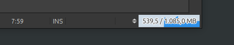
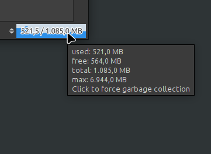

# Memory Statusline

The plugin shows the memory usage in the Netbeans status line. It's mostly like the memory monitor in the toolbar.

There is a tooltip with more details.

If you click on the memory monitor the garbage collector will be started.

